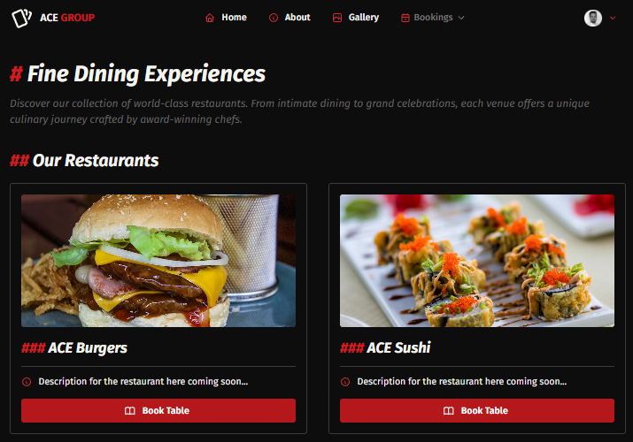
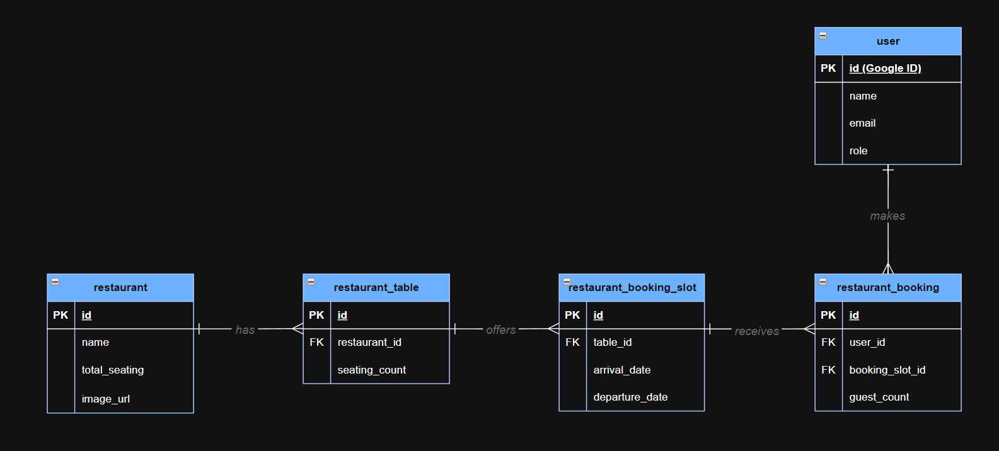
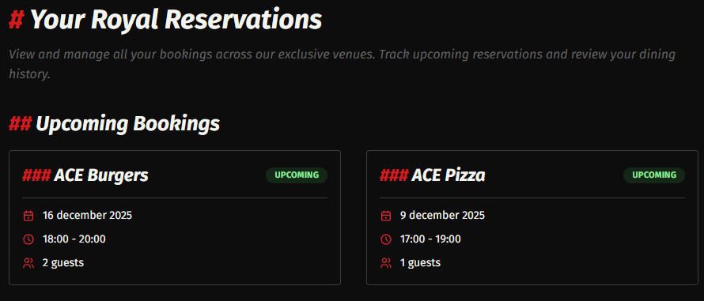
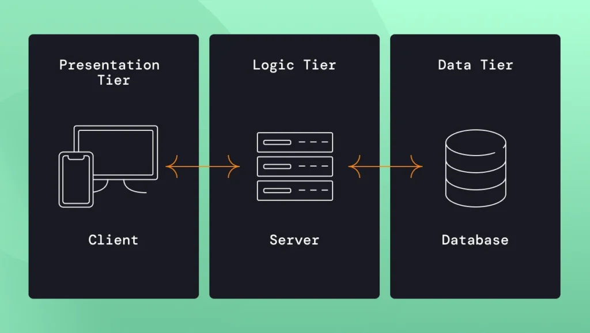
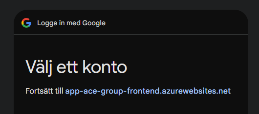
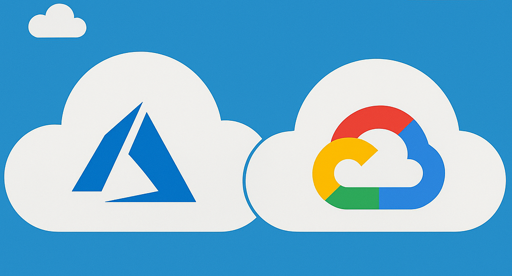
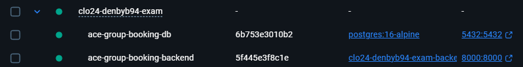
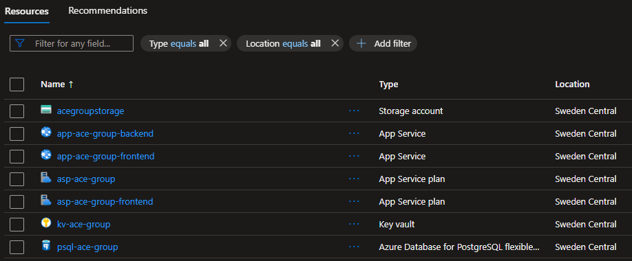
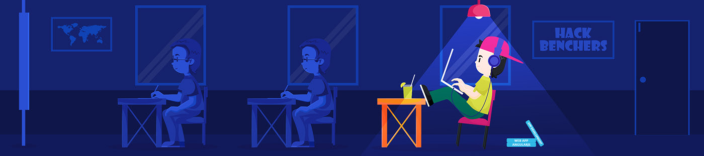

# Teknisk Dokumentation - Dennis Byberg

**Kurs:** Examensarbete (40p)  
**Student:** Dennis Byberg  
**Lärare:** Marcus Medina Ramirez  
**Klass:** CLO24  
**Datum:** 2025-12-09


### Innehåll

1. [Inledning - Från Restaurangbranschen till Fullstack-utveckling](#1-inledning---från-restaurangbranschen-till-fullstack-utveckling)
2. [Produkten - Automatiserad Bordsbokning Dygnet Runt](#2-produkten---automatiserad-bordsbokning-dygnet-runt)
3. [Verktyg och Teknologier - 23 Verktyg, Ett Syfte](#3-verktyg-och-teknologier---23-verktyg-ett-syfte)
4. [Projektarkitektur - Monorepo med Tydliga Gränser](#4-projektarkitektur---monorepo-med-tydliga-gränser)
5. [Applikationens Komponenter - Where the Magic Happens](#5-applikationens-komponenter---where-the-magic-happens)
6. [Flöden - Från Klick till Databas](#6-flöden---från-klick-till-databas)
7. [Testning - Kvalitet Utan Automatiska Tester](#7-testning---kvalitet-utan-automatiska-tester)
8. [Deployment - Från Localhost till Azure](#8-deployment---från-localhost-till-azure)
9. [Avslutande Reflektioner - Vad Jag Lärt Mig](#9-avslutande-reflektioner---vad-jag-lärt-mig)
10. [Referenser](#10-referenser)

## 1. Inledning - Från Restaurangbranschen till Fullstack-utveckling

Detta är min tekniska dokumentation för examensarbetet där jag byggde en komplett bokningsplattform för restauranger. Som gammal restaurangare har jag själv upplevt hur jobbigt telefonbokningar är, personal som står i baren och serverar mat samtidigt som telefonen ringer konstant. Detta var motivationen bakom att bygga ett system där kunder kan boka bord dygnet runt utan att behöva ringa.

Projektet är mitt examensarbete på 40 poäng och samtidigt en förberedelse inför min kommande LIA där jag ska använda liknande teknologier. Detta var första gången jag byggde något så här omfattande från scratch. Jag kom från en .NET-bakgrund och behövde lära mig Python, React och Azure samtidigt, ganska utmanande! Men det gav mig en bred förståelse för hur alla delar i ett fullstack-system hänger ihop.



Systemet jag byggde heter ACE Group Booking Platform, vilket är ett fiktivt koncept jag skapade för att demonstrera funktionaliteten. Min riktiga LIA är på ESS Group, men jag ville inte använda deras data i examensarbetet på grund av respektfulla skäl. Plattformen består av en backend i Python med FastAPI, en frontend i React med Next.js, en PostgreSQL-databas, och allt körs i Azure-molnet. Hela infrastrukturen är definierad som kod med Terraform, och deployment sker automatiskt via GitHub Actions.

## 2. Produkten - Automatiserad Bordsbokning Dygnet Runt

_Detta kapitel beskriver vad bokningsplattformen är, vilka problem den löser, och hur systemet är uppbyggt på en övergripande nivå._

### 2.1 Översikt

Systemet har 6 seedade restauranger (ACE Burgers, Sushi, Pizza, Steakhouse, Vegan, Seafood) men kan tekniskt hantera hur många som helst. Varje restaurang har sin egen uppsättning av bord med olika kapacitet, och för varje bord finns bokningsluckor som representerar tillgängliga tider. När en kund bokar ett bord markeras bokningsluckan som upptagen, och ingen annan kan boka samma tid.

Systemet är byggt för att vara skalbart, även om jag seedade 6 restauranger för demo-syften kan plattformen hantera hur många restauranger som helst eftersom databas-designen inte är hårdkodad för ett specifikt antal.

**Databastabeller:**

**User:** Google OAuth-användare
**Restaurant:** Restauranginfo
**Restaurant Table:** Bord (4-100 platser)
**Restaurant Booking Slot:** Tillgängliga tider
**Restaurant Booking:** Faktiska bokningar



### 2.2 Lösning

Systemet löser problemen med traditionella telefonbokningar genom att automatisera hela bokningsprocessen. Istället för att personal måste hantera varje bokning manuellt kan kunder själva välja restaurang, datum, tid och antal gäster direkt i webbläsaren.

**Automatisk validering:**
Pydantic (backend) + Zod (frontend) + PostgreSQL constraints förhindrar fel. Detta betyder att om en kund försöker boka 200 personer på ett 4-personersbord, fångar systemet felet redan i formuläret innan det ens skickas till servern. Om någon försöker boka igår fångar Zod det. Om två personer försöker boka samma tid samtidigt förhindrar UNIQUE constraint i databasen dubbelbokning.

**24/7 tillgänglighet:**
Kunder kan boka när som helst utan personalinteraktion. Detta var hela poängen - en kund som vill boka bord klockan 23:00 på söndagkväll kan göra det utan att vänta till måndag morgon när restaurangen öppnar.

**Översikt:**
"Mina Bokningar"-sida visar alla kommande och tidigare bokningar. Kunden behöver inte ringa för att kolla sin bokning eller ändra någonting - allt finns tillgängligt direkt i gränssnittet. De kan avboka med ett knapptryck, och bokningsluckan blir automatiskt tillgänglig för andra kunder.



### 2.3 Arkitektur

Jag följde en klassisk trelagers-arkitektur där varje del har sitt eget ansvarsområde. Frontenden (Next.js) hanterar användargränssnittet och all interaktion med kunden. När någon klickar på "Boka bord" skickar frontenden ett API-anrop till backenden (FastAPI) som validerar datan, kollar tillgänglighet och pratar med databasen (PostgreSQL). Varje lager kan uppdateras eller bytas ut utan att påverka de andra - till exempel skulle jag kunna byta Next.js mot Vue.js utan att röra backenden.

**Deployment:**
Azure App Service med Terraform-infrastruktur, GitHub Actions för CI/CD. Detta betyder att all infrastruktur är definierad som kod, jag kan radera hela systemet och återskapa det exakt likadant med ett enda kommando. GitHub Actions övervakar alla ändringar i koden och deployas automatiskt till Azure när jag pushar till `dev`-branchen.



## 3. Verktyg och Teknologier - 23 Verktyg, Ett Syfte

_Jag använde 23 verktyg i projektet, vilket kan låta mycket men varje verktyg har ett specifikt syfte. Alla val är dokumenterade i ADRs (Architecture Decision Records) där jag förklarar varför jag valde just dessa teknologier över alternativen. Som junior utvecklare har jag försökt förstå varför jag väljer ett verktyg framför ett annat, inte bara säga att alla andra använder det._

### 3.1 Backend

Backend är byggd i Python eftersom det är vad praktikplatsen använder. FastAPI valdes för sin automatiska dokumentation och enkla validering med Pydantic.

| Verktyg        | Varför                                             |
| -------------- | -------------------------------------------------- |
| **FastAPI**    | Automatisk API-docs, Pydantic-validering           |
| **SQLAlchemy** | ORM - Python istället för SQL                      |
| **Alembic**    | Databas-migrations                                 |
| **UV**         | Package manager (10-100x snabbare än pip)          |
| **Ruff**       | Linting + formattering, GitHub Actions-integration |

### 3.2 Frontend

Frontenden är Next.js med TypeScript för att fånga fel tidigt. Mantine levererade alla UI-komponenter jag behövde utan att behöva bygga allt från scratch.

| Verktyg            | Varför                                   |
| ------------------ | ---------------------------------------- |
| **Next.js 16**     | App Router, SSR, bildoptimering          |
| **React 19**       | Komponenter och hooks                    |
| **TypeScript**     | Fångar fel vid compile-time              |
| **Mantine 8**      | 100+ färdiga komponenter                 |
| **TanStack Query** | Automatisk caching av API-data           |
| **NextAuth.js**    | Google OAuth                             |
| **Zod**            | Formulärvalidering                       |
| **Bun**            | Package manager (10-20x snabbare än npm) |
| **ESLint**         | Linting, körs i GitHub Actions           |

### 3.3 Databas

PostgreSQL 16 valdes för ACID-garantier och kraftfulla constraints. Vad menar jag med detta? Jo, ACID står för Atomicity, Consistency, Isolation, Durability - det betyder att antingen går hela transaktionen igenom eller så händer ingenting alls. Om systemet krashar mitt under en bokning kommer databasen aldrig att hamna i ett halvfärdigt tillstånd där bordet är bokat men ingen användare är kopplad till bokningen.

UNIQUE constraint på `booking_slot_id` gör det omöjligt att dubblaboka även om två personer klickar exakt samtidigtm, något som hade varit mycket svårare att implementera i applikationslogiken.

SQLAlchemy ORM betyder att jag kan skriva Python istället för SQL. Alembic migrations håller koll på alla schema-ändringar så att jag kan rulla tillbaka om något går fel.

### 3.4 Infrastruktur

Hela systemet körs i Azure. Totalkostnaden är cirka 580 kr/månad för en fullständig produktionsmiljö.

| Azure-resurs      | Kostnad/månad |
| ----------------- | ------------- |
| App Service (B1)  | ~200 kr       |
| PostgreSQL (B1ms) | ~350 kr       |
| Blob Storage      | ~10 kr        |
| Key Vault         | ~20 kr        |
| **Totalt**        | **~580 kr**   |

**Terraform (Infrastructure as Code):**
Istället för att klicka runt i Azure Portal definierar jag all infrastruktur i kod. Om jag råkar radera något kan jag återskapa exakt samma miljö med `terraform apply`.

**Docker Compose:**
Lokalt kör jag PostgreSQL och backend i Docker containers. Detta betyder att alla utvecklare får exakt samma miljö.

**GitHub Actions (CI/CD):**
Varje push till `dev`-branchen triggar automatisk deployment. Linting körs först, om koden inte följer standards deployas ingenting.

## 4. Projektarkitektur - Monorepo med Tydliga Gränser

_Detta kapitel förklarar hur hela systemet är organiserat, hur data flödar mellan delarna, och hur jag strukturerat koden för att hålla det överskådligt._

### 4.1 Systemöversikt

Projektet är organiserat som en monorepo, allt i ett Git-repository men uppdelat i tre tydliga delar: `backend/`, `frontend/`, `infrastructure/`. Detta underlättar deployment eftersom jag kan deploya frontend och backend oberoende av varandra.

**Auth:**
Google OAuth → NextAuth JWT i HTTP-only cookie → Backend validerar

HTTP-only cookies betyder att JavaScript inte kan läsa token, detta förhindrar attacker. Om någon lyckas injicera skadlig JavaScript i webbläsaren kan de inte stjäla användarens session.

**Miljöer:**
Systemet fungerar både lokalt (Docker) och i Azure (produktion). Lokalt kan jag köra mock auth för att slippa logga in med Google varje gång under utveckling.

| Aspekt  | Lokalt                  | Azure                             |
| ------- | ----------------------- | --------------------------------- |
| Backend | `localhost:8000`        | `https://<app>.azurewebsites.net` |
| Databas | Docker PostgreSQL       | Azure PostgreSQL                  |
| Auth    | Mock (`MOCK_AUTH=true`) | Google OAuth                      |
| Secrets | `.env` filer            | Key Vault                         |

### 4.2 Struktur

Kodbasen är strukturerad för att separera olika ansvarsområden. Backend-kod påverkar inte frontend-kod och vice versa. Infrastructure-kod definierar Azure-resurser.

#### 4.2.1 Projektrot

```
clo24-denbyb94-exam/
├── backend/
├── frontend/
├── infrastructure/
├── docs/adr/
└── .github/
```

**backend/:**
Hela Python FastAPI-applikationen med all serverlogik, databasmodeller, API-endpoints och validering.

**frontend/:**
Next.js React-applikationen med användargränssnittkod, komponenter och klientlogik.

**infrastructure/:**
Terraform-filer som definierar Azure-resurser som kod + deployment-scripts.

**docs/adr/:**
Architecture Decision Records som dokumenterar varför jag valde specifika teknologier och lösningar.

**.github/:**
GitHub Actions workflows för CI/CD med automatisk linting och deployment.

#### 4.2.2 Backend-struktur

```
backend/
├── app/
│   ├── db/
│   ├── models/
│   ├── routers/
│   ├── schemas/
│   ├── dependencies/
│   ├── config.py
│   └── main.py
├── alembic/
│   └── versions/
└── Dockerfile
```

**app/db/:**
Databas-session setup och seed-script som fyller databasen med test-data/start-data.

**app/models/:**
SQLAlchemy ORM-modeller som definierar databastabeller (User, Restaurant, RestaurantTable, BookingSlot, Booking).

**app/routers/:**
FastAPI-routers som exponerar API-endpoints (auth.py, health.py, restaurant/).

**app/schemas/:**
Pydantic-schemas för request/response-validering. Förhindrar invalid data från att nå databasen.

**app/dependencies/:**
Dependency injection-funktioner, främst auth.py som validerar JWT-tokens.

**app/config.py:**
Läser miljövariabler från `.env` och exponerar dem via Pydantic Settings. En enda källa för all konfiguration.

**app/main.py:**
Entry point för FastAPI-applikationen. Här registreras routers, CORS, middleware och Swagger UI.

**alembic/versions/:**
Migration-filer i kronologisk ordning som spårar alla schema-ändringar i databasen.

**Dockerfile:**
Definierar hur backend-containern byggs. Installerar dependencies, kopierar kod, exponerar port 8000.

#### 4.2.3 Frontend-struktur

```
frontend/src/
├── app/
│   ├── page.tsx
│   └── bookings/
├── components/
│   ├── BookingModal.tsx
│   ├── RestaurantCard.tsx
│   └── Header.tsx
├── lib/api/
│   └── client.ts
├── providers/
└──theme/
```

**app/:**
Next.js App Router där varje mapp automatiskt blir en route. `app/bookings/page.tsx` blir `/bookings`.

**components/:**
Återanvändbara React-komponenter som `BookingModal` (bokningsformulär), `RestaurantCard` (restaurangvisning), `Header` (navigation).

**lib/api/client.ts:**
`apiClient()` som wraps alla API-anrop. Hanterar errors, sätter headers och centraliserar all backend-kommunikation.

**providers/:**
React Context providers för global state management och NextAuth session provider.

**theme/:**
Mantine UI theme-konfiguration (färger, typsnitt, spacing).

## 5. Applikationens Komponenter - Where the Magic Happens

_Detta kapitel beskriver hur de fyra huvuddelarna fungerar: backend (API + logik), frontend (UI + interaktion), databas (lagring + relationer), och infrastruktur (Azure-resurser + deployment)._

### 5.1 Backend

Backend bygger på FastAPI och skapar ett REST API som hanterar all affärslogik. Varje request går genom flera lager: först autentisering, sedan validering, därefter affärslogik, och slutligen databas-operationer. Hur coolt som helst!

**API-endpoints:**

| Endpoint                                           | Method | Funktion                    | Auth |
| -------------------------------------------------- | ------ | --------------------------- | ---- |
| `/health`                                          | GET    | Health check                | Nej  |
| `/health/detailed`                                 | GET    | Detaljerad health check     | Nej  |
| `/api/version`                                     | GET    | API version                 | Nej  |
| `/api/auth/me`                                     | GET    | Inloggad användare          | Ja   |
| `/api/restaurants`                                 | GET    | Lista restauranger          | Ja   |
| `/api/restaurants/{restaurant_id}`                 | GET    | Hämta specifik restaurang   | Ja   |
| `/api/restaurants/{restaurant_id}/available-slots` | GET    | Tillgängliga bokningsluckor | Ja   |
| `/api/bookings/me`                                 | GET    | Användarens bokningar       | Ja   |
| `/api/bookings`                                    | POST   | Skapa bokning               | Ja   |

**Säkerhet:**
Pydantic kollar all input innan den når backend-logiken. Om någon försöker skicka `guest_count: -5` får de direkt ett felmeddelande. SQLAlchemy skyddar automatiskt mot SQL injection-attacker. JWT-tokens valideras i `auth.py` innan användaren får tillgång till skyddade API-endpoints.

**Skydd mot dubbelbokning:**
Databasen använder UNIQUE constraint på `booking_slot_id` som garanterar att ingen tid kan bokas två gånger. Om två personer försöker boka exakt samtidigt kommer den första lyckas och den andra få ett felmeddelande. Enkelt och säkert!

**Test-data:**
Seed-scriptet `app/db/seed_restaurant_data.py` skapar 6 restauranger med 10-15 bord vardera (4, 6 eller 8 platser per bord). För varje bord skapas bokningsluckor för de kommande 30 dagarna, mellan 17:00-22:00 med 1 timmes mellanrum.

**Databas-ändringar:**
Alembic håller koll på alla schema-ändringar genom migrations. Jag har skapat fyra stycken: en för initial schema, en för restaurangbilder, en för att höja max platser till 100, och en för att lägga till dubbelbokningsskydd.

### 5.2 Frontend

Frontenden är en Single Page Application (SPA) med Next.js 16. Första gången du besöker sidan renderas den på servern, sedan sker all navigation i webbläsaren. TanStack Query hämtar data från backend och sparar den i cache för snabbare laddning.

**Routing:**
Next.js mappar automatiskt filsystemet till URLs. Filen `app/bookings/page.tsx` blir automatiskt routen `/bookings`. Slipper konfigurera routes manuellt.

**Komponenter:**
`BookingModal` hanterar bokningsformuläret och använder Zod för att validera input direkt i webbläsaren. `RestaurantCard` visar restauranginfo och öppnar modal när du klickar. `Header` visar navigation och användarens namn.

**Data-hantering:**
TanStack Query sparar API-data i cache. När du skapar en bokning uppdateras listan automatiskt utan att du behöver ladda om sidan. Bokningen visas direkt i UI:t, och om något går fel rullas ändringen tillbaka.

**Inloggning:**
NextAuth hanterar Google OAuth-inloggning.

### 5.3 Databas

Databasen använder PostgreSQL 16 med fem tabeller. Varje tabell har ett specifikt syfte och data upprepas aldrig i onödan.

**Tabeller:**
`user` - Användare från Google OAuth (varje email kan bara finnas en gång)
`restaurant` - Restauranginfo med namn, beskrivning och bild
`restaurant_table` - Bord som kan ha 1-100 platser
`restaurant_booking_slot` - Lediga tider för varje bord
`restaurant_booking` - Bokningar (varje tid kan bara bokas en gång)

**Hur tabellerna hänger ihop:**
En restaurang har många bord. Ett bord har många lediga tider. Varje ledig tid kan max bokas av en person. En användare kan ha många bokningar.

### 5.4 Infrastruktur

Systemet körs i Azure med fyra huvuddelar: App Service (där koden körs), PostgreSQL (databas), Blob Storage (bilder), och Key Vault (hemliga nycklar).

**App Service (B1):**
Kör både frontend och backend tillsammans. Docker-filen paketerar allt i en container. När servern startar körs automatiskt databas-uppdateringar och test-data laddas in. Kostar cirka 200 kr/månad.

**PostgreSQL Flexible Server (B1ms):**
Hanterad databas som backas upp automatiskt varje natt. Uppkopplingssträngen sparas säkert i Key Vault och hämtas när appen startar. Kostar cirka 350 kr/månad.

**Blob Storage:**
Lagrar restaurangbilder som är publikt tillgängliga. Terraform skapar denna automatiskt. Kostar cirka 10 kr/månad.

**Key Vault:**
Lagrar känslig information: databasadress, Google OAuth-nycklar, JWT-signeringsnyckel. GitHub Actions hämtar dessa vid deployment och sätter som miljövariabler. Kostar cirka 20 kr/månad.

**Deployment:**
När jag pushar kod till `dev`-branchen startar GitHub Actions automatiskt. Den bygger en Docker-image, skickar den till Azure, och uppdaterar appen. Servern startar om och är live inom 3-5 minuter.

## 6. Flöden - Från Klick till Databas

_Detta kapitel beskriver de tre viktigaste flödena i systemet: autentisering, dataflöden och externa API:er._

### 6.1 Autentisering

Systemet använder Google OAuth via NextAuth.js för inloggning. När användaren klickar "Logga in med Google" redirectas de till Googles inloggningssida, godkänner åtkomst, och redirectas tillbaka med en auktoriseringskod. NextAuth utbyter denna kod mot en JWT-token som lagras i en HTTP-only cookie.

**Säkerhet:** HTTP-only cookies skyddar mot attacker eftersom JavaScript inte kan läsa dem. JWT-tokens har expiry-tid och förnyas automatiskt. Backend validerar varje token innan den tillåter access.

**Flödet:**

1. Användare klickar "Logga in med Google"
2. Google OAuth returnerar authorization code
3. NextAuth utbyter code mot JWT token
4. Token lagras i HTTP-only cookie
5. Backend verifierar JWT och hämtar/skapar user
6. Första gången user loggar in skapas automatiskt profil med `customer`-roll

**Dev-läge:** `MOCK_AUTH=true` skapar test-user automatiskt för snabbare utveckling.



### 6.2 Dataflöden

All data i systemet flödar genom ett standardiserat mönster från användaren till databasen och tillbaka. Detta säkerställer konsekvent felhantering och validering.

**Request-Response-cykel:**

Frontend → TanStack Query → apiClient() → FastAPI → Pydantic → SQLAlchemy → PostgreSQL

1. **Frontend:** Användare klickar på knapp eller fyller i formulär
2. **TanStack Query:** Kollar cache först (5 min), annars gör API-anrop
3. **apiClient():** Lägger till session cookie automatiskt
4. **FastAPI:** Router matchar endpoint och injicerar dependencies (auth, db)
5. **Pydantic:** Validerar input
6. **SQLAlchemy:** Kör parametriserad query (SQL injection-skydd)
7. **Response:** JSON med statuskod skickas tillbaka
8. **Cache:** TanStack Query sparar svaret för framtida requests
9. **UI:** React re-renderar automatiskt med ny data

**Optimistic Updates:** För bättre användarupplevelse visas bokningar direkt i UI innan servern svarat. Om request misslyckas rullas ändringen tillbaka automatiskt.

**Error-hantering:**

| HTTP | Typ     | Resultat               |
| ---- | ------- | ---------------------- |
| 422  | Input   | Felmeddelande per fält |
| 401  | Auth    | Redirect till login    |
| 403  | Access  | "Ingen behörighet"     |
| 500  | Server  | "Något gick fel"       |
| -    | Nätverk | "Kunde inte ansluta"   |

### 6.3 Externa API:er

Systemet integrerar med två externa API:er för autentisering och fillagring.

1. **Google OAuth API:**
   Används för användarautentisering. NextAuth.js hanterar hela OAuth-flödet automatiskt. Kräver Google Cloud Console-konfiguration med Client ID och Client Secret som lagras i Azure Key Vault i produktion.

   **Fördelar:** Användare slipper skapa konto, bekant inloggningsupplevelse, Google hanterar lösenordsåterställning.

2. **Azure Blob Storage API:**
   Lagrar restaurangbilder i en public blob container. Terraform skapar containern och sätter public read access.

   **Fördelar:** automatiska backups, minimal kostnad, slipper lagra på github (~10 kr/mån).



## 7. Testning - Kvalitet Utan Automatiska Tester

_Testning är en del av projektet som jag inte är stolt över. Jag hann helt enkelt inte skriva automatiska tester, och detta är något jag ångrar. Tiden räckte inte för att både lära mig systemutveckling och skriva ordentliga tester. Detta kapitel beskriver hur jag hanterade kvalitetssäkring utan automatiserade tester._

### 7.1 Varför Inga Tester?

När jag startade projektet trodde jag att jag skulle hinna med allt... backend, frontend, deployment och tester. Men verkligheten var annorlunda. Jag var överväldigad av att bygga mitt första stora projekt från scratch. Varje dag lärde jag mig nya saker: hur FastAPI fungerar, hur React hooks ska användas, hur Terraform skapar resurser i Azure.

Mitt fokus blev att få funktionaliteten att fungera. Jag prioriterade att bygga ett system som faktiskt fungerade framför att skriva tester för kod som kanske skulle ändras nästa dag. I retrospekt vet jag att detta var fel approach, tester skulle faktiskt ha hjälpt mig hitta buggar tidigare och gett mig mer självförtroende i koden.

**Istället använde jag:**

1. TypeScript strict mode (fångar fel vid compile-time)
2. Pydantic runtime-validering (validerar all API-input)
3. PostgreSQL constraints (UNIQUE förhindrar dubbelbokning)
4. GitHub Actions linting (Ruff + ESLint blockerar dålig kod)


### 7.2 Manuell Testning

Eftersom jag inte hade automatiska tester blev manuell testning min huvudsakliga kvalitetssäkring. Varje gång jag implementerade en feature testade jag den noggrant i olika scenarier.

**Backend-testning:**
FastAPI's automatiska Swagger UI (`/docs`) blev min bästa vän. Jag kunde skicka requests direkt från webbläsaren och se exakt vad som returnerades. När jag implementerade bokningsfunktionen testade jag att skicka invalid data. Negativa gästantal, tidigare datum, felaktiga IDs. Pydantic validerade allt och returnerade tydliga felmeddelanden.

För att testa databas-constraints öppnade jag två webbläsarfönster och försökte boka samma tid samtidigt. UNIQUE constraint på `booking_slot_id` blockerade dubbelbokningen perfekt,exakt som det skulle.

Auth-flödet testade jag genom att simulera olika felfall: ingen token (401), expired token, försök att redigera andras bokningar (403), och mock auth i dev-läge. Varje scenario gav korrekta felmeddelanden.

**Frontend-testning:**

Chrome DevTools blev mitt testverktyg för responsive design. Jag simulerade iPhone, iPad och Desktop för att verifiera att layouten anpassade sig korrekt.

### 7.3 CI/CD som Kvalitetskontroll

Även om jag inte körde automatiska tester hade jag ändå automatiserad kvalitetskontroll via GitHub Actions. Varje pull request till `dev` triggade linting-workflows.

**Linting-workflows:**

| Workflow      | Verktyg             | Blockerande Fel                                             |
| ------------- | ------------------- | ----------------------------------------------------------- |
| Backend Lint  | Ruff                | Oanvända imports, för långa rader, dålig formattering       |
| Frontend Lint | ESLint + TypeScript | `any`-types, glömda dependencies, inkonsistent formattering |

Kod som inte följde projektets standards kom helt enkelt inte in i `dev`-branchen. Detta är inte samma sak som tester, men det förhindrade åtminstone uppenbara kodkvalitetsproblem.

## 8. Deployment - Från Localhost till Azure

_Deployment var en av de mest utmanande delarna i projektet. Att få allt att fungera lokalt var en sak, men att deploya till Azure och få alla delar att prata med varandra i molnet var något helt annat. Detta kapitel beskriver min resa från lokal utveckling till automatiserad deployment i Azure._

### 8.1 Lokal Utveckling

Lokalt körs allt via Docker Compose vilket ger mig en konsekvent utvecklingsmiljö. När jag kör `docker-compose up -d` startar både PostgreSQL-databasen och FastAPI-backend i containers. Detta betyder att alla utvecklare får exakt samma miljö oavsett om de kör Windows, Mac eller Linux.

Efter att containrarna är igång måste jag seeda databasen med testdata. Seed-scriptet skapar 6 restauranger med bord och bokningsluckor för kommande 30 dagar. Scriptet är idempotent vilket betyder att jag kan köra det flera gånger utan att få dubbletter.

Frontend startar jag separat med Bun eftersom Next.js development server ger hot reload och snabbare feedback än att bygga om en container varje gång.

**Setup-kommandon:**

```bash
docker-compose up -d                                        # PostgreSQL + FastAPI
cd backend && uv run python -m app.db.seed_restaurant_data  # Seed data
cd frontend && bun install && bun run dev                   # Next.js
```



**Miljövariabler:** Hanteras via `.env`-filer som aldrig committas till Git. Exempel-filer (`.env.example`) visar vilka variabler som behövs.

### 8.2 CI/CD Pipeline

Att manuellt deploya till Azure varje gång jag ändrade något skulle ta alldeles för lång tid. Därför byggde jag en automatiserad pipeline med GitHub Actions som kör vid varje push till `dev`-branchen.

Pipelinen fungerar i två steg: först kvalitetskontroll via linting när jag skapar en pull request, sedan automatisk deployment när koden mergas. Detta betyder att dålig kod aldrig kommer in i systemet, och god kod deployas automatiskt.

**Workflows:**

| Workflow        | Trigger               | Syfte                                  |
| --------------- | --------------------- | -------------------------------------- |
| Backend Lint    | PR → dev              | Blockera kod som inte följer standards |
| Frontend Lint   | PR → dev              | ESLint + TypeScript type checking      |
| Deploy Backend  | Push → dev (backend)  | Automatisk deploy till Azure           |
| Deploy Frontend | Push → dev (frontend) | Automatisk deploy till Azure           |

Det har hänt flera gånger att jag trodde koden var redo, skapade en PR, och fick reda på att linting misslyckades. Detta kan kännas frustrerande i stunden men sparar enormt mycket tid senare eftersom buggar upptäcks tidigt.

**Deployment-flöde:**

1. Linting körs först, om det misslyckas deployas ingenting
2. GitHub Actions bygger applikationen, installerar dependencies, kompilerar TypeScript
3. Azure deployment, koden deployas till App Service
4. Startup script körs, migrations, seed-data, starta server
5. 3-5 minuter senare är appen live på Azure

Det mest utmanande var secrets management. Lokalt har jag alla värden i `.env`-filer, men i Azure måste samma värden finnas tillgängliga på ett säkert sätt. Lösningen blev Azure Key Vault kombinerat med GitHub Secrets. Terraform skapar Key Vault och lagrar känsliga värden som databas-URL och Google OAuth secrets. GitHub Actions hämtar dessa vid deployment och sätter dem som environment variables.

### 8.3 Azure Infrastructure

Hela infrastrukturen definieras som kod med Terraform. Detta betyder att jag aldrig klickar rund i Azure Portal. Allt finns i `.tf`-filer som versionshanterlas i Git. Om jag råkar radera något kan jag köra `terraform apply` och få tillbaka exakt samma setup.



**Azure-resurser och kostnader:**

| Resurs                     | Kostnad/mån | Beskrivning                              |
| -------------------------- | ----------- | ---------------------------------------- |
| App Service (B1)           | ~200 kr     | Kör frontend + backend                   |
| PostgreSQL Flexible (B1ms) | ~350 kr     | Database med automatiska nightly backups |
| Blob Storage               | ~10 kr      | Restaurangbilder                         |
| Key Vault                  | ~20 kr      | Lagrar secrets säkert                    |
| **Totalt**                 | **~580 kr** | Komplett produktionsmiljö                |

## 9. Avslutande Reflektioner - Vad Jag Lärt Mig

Detta projekt har varit den svåraste och mest omfattande tekniska utmaningen jag tagit mig an hittills i mitt liv som student. Från restaurangbranschen till att bygga en fullstack-bokningsplattform på teknologier jag aldrig använt innan var en resa fylld av frustration och massor av lärande.

Den största lärdomen är att jag nu förstår vad "fullstack" faktiskt innebär. Det är inte bara att kunna både frontend och backend, det är att förstå hur alla delar pratar med varandra, hur data flödar genom systemet, hur säkerhet måste tänkas igenom på varje nivå och hur deployment är lika viktig som själva koden. Jag har gjort misstag på vägen, framför allt när det gäller testning där jag prioriterade funktionalitet framför kvalitetssäkring. Men varje misstag har lärt mig något värdefullt.

Teknologivalen jag gjorde i början av projektet har visat sig vara solida. FastAPI's automatiska dokumentation via Swagger UI är magisk. Next.js App Router var förvirrande i början men gav mig kraftfull routing och bildoptimering gratis, listan kan göras lång.

Inför min kommande LIA på ESS Group känner jag mig väl förberedd. Jag har inte bara lärt mig Next.js & Python, jag har byggt ett komplett system från scratch och sett hur alla delar hänger ihop. Jag vet nu vad som krävs för att ta ett projekt från idé till deployment och jag har 23 ADRs som dokumenterar varje tekniskt beslut jag tagit längs vägen. Trots alla utmaningar står jag här med ett fungerande system som löser ett verkligt problem, och det känns bra...

...RIKITGT BRA!



## 10. Referenser

Detta kapitel listar alla externa resurser och dokumentation som användes under projektets utveckling.

ACE Group Booking Platform - GitHub Repository  
[https://github.com/DennisByberg/clo24-denbyb94-exam](https://github.com/DennisByberg/clo24-denbyb94-exam)

Python.org - Official Documentation  
[https://www.python.org/](https://www.python.org/)

FastAPI Official Documentation  
[https://fastapi.tiangolo.com/](https://fastapi.tiangolo.com/)

Next.js Official Documentation  
[https://nextjs.org/](https://nextjs.org/)

React Documentation  
[https://react.dev/](https://react.dev/)

NextAuth.js Documentation  
[https://next-auth.js.org/](https://next-auth.js.org/)

PostgreSQL Documentation  
[https://www.postgresql.org/docs/](https://www.postgresql.org/docs/)

Microsoft Azure Documentation  
[https://docs.microsoft.com/azure/](https://docs.microsoft.com/azure/)

Terraform Documentation  
[https://developer.hashicorp.com/terraform](https://developer.hashicorp.com/terraform)

SQLAlchemy Documentation  
[https://docs.sqlalchemy.org/](https://docs.sqlalchemy.org/)

Mantine UI Documentation  
[https://mantine.dev/](https://mantine.dev/)

TanStack Query Documentation  
[https://tanstack.com/query/latest](https://tanstack.com/query/latest)
