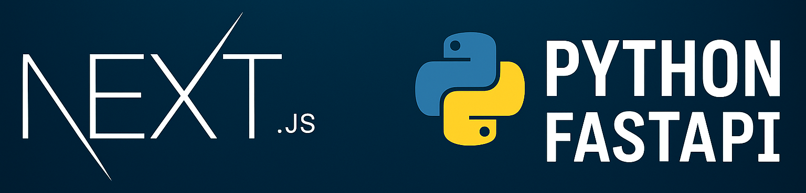

# Verktygspresentation - Dennis Byberg

**Kurs:** Examensarbete (40p)  
**Student:** Dennis Byberg  
**Lärare:** Marcus Medina Ramirez  
**Klass:** CLO24  
**Datum:** 2025-12-08

### Innehåll

1. [Syfte - Problemet och Lösningen](#1-syfte---problemet-och-lösningen)
2. [Målgrupp - Vem Använder Systemet?](#2-målgrupp---vem-använder-systemet)
3. [Översikt - Systemets Uppbyggnad](#3-översikt---systemets-uppbyggnad)
4. [Huvudfunktioner - Vad Kan Användare Göra?](#4-huvudfunktioner---vad-kan-användare-göra)
5. [Roller - Olika Användares Perspektiv](#5-roller---olika-användares-perspektiv)
6. [Fördelar - Varför Använda Bokningsplattformen?](#6-fördelar---varför-använda-bokningsplattformen)
7. [Scenario - Ett Verkligt Användningsexempel](#7-scenario---ett-verkligt-användningsexempel)
8. [Sammanfattning - Projektet i Sammandrag](#8-sammanfattning---projektet-i-sammandrag)
9. [Referenser](#9-referenser)

## 1. Syfte - Problemet och Lösningen

### 1.1 Problemet med Traditionell Bordsbokning

I dagens samhälle är många kunder vana vid att kunna boka och beställa tjänster online, dygnet runt. Allt från resor och hotell till bioplatser och frisörtider. Restaurangbokning har däremot ofta varit beroende av telefonsamtal under mycket begränsade öppettider. Detta skapar frustration när kunder vill boka bord sent på kvällen, tidigt på morgonen eller under helger om restaurangen är stängd.

För restaurangerna innebär telefonbokning också utmaningar. Personal måste avbryta sitt arbete för att svara i telefon, manuellt skriva ner bokningar i en bok eller system och det finns då risk för mänskliga fel som dubbelbokning eller felaktig registrering av antal gäster. Detta tar värdefull tid från att ge uppmärksamhet åt gästerna som redan är på plats och betalar pengar för en upplevelse.

### 1.2 Lösningen - En Modern Bokningsplattform

Bokningsplattformen skapades för att lösa dessa problem genom att erbjuda **enkel och snabb bordsbokning online, tillgänglig dygnet runt**. Systemet automatiserar hela bokningsprocessen från början till slut vilket gynnar både kunder och restauranger.

För kunder innebär det frihet att boka när som helst som passar dem, utan att behöva vänta på öppettider eller telefonkö. De får omedelbar bekräftelse på sin bokning och kan se alla sina kommande besök samlade på ett ställe.

För restauranger innebär det minskad administrativ börda. Bokningar registreras automatiskt, systemet förhindrar dubbelbokning och personalen kan fokusera på att ge bästa möjliga service till gästerna som är på plats.

Som gammal restaurangare har jag själv upplevt detta problem. Att stå ute i baren och servera mat samtidigt som telefonen ringer konstant kan kännas som att sitta i en telefonväxel. Detta skapade motivationen att bygga en lösning som skulle frigöra personal från telefonbokningen och låta dem fokusera på det viktigaste. Samtidigt blev projektet en perfekt förberedelse inför min kommande praktik där jag får arbeta med samma teknologier.

## 2. Målgrupp - Vem Använder Systemet?

Bokningsplattformen riktar sig framförallt till **restaurangkunder** som vill boka bord online på ett enkelt och smidigt sätt. Det kan vara allt från unga par som planerar en romantisk middag till familjer som vill fira födelsedagar eller affärsmänniskor som behöver boka lunch med klienter. Gemensamt för alla är behovet av snabb och pålitlig bordsbokning utan att behöva ringa under begränsade telefontider.

Systemet är byggt för att vara inbjudande och tillgängligt för alla, oavsett ålder eller teknisk bakgrund. En 70-åring som aldrig använt en bokningsapp tidigare ska kunna navigera systemet lika enkelt som en 25-åring som är van vid digitala tjänster.

## 3. Översikt - Systemets Uppbyggnad

Bakom den enkla användarupplevelsen arbetar systemet i fyra huvuddelar som säkerställer att allt fungerar smidigt och säkert:

**Användargränssnittet** är det kunden ser och klickar i, byggt med Next.js och React. Det är byggt för att vara snabbt och responsivt. All design är fokuserad på enkelhet, inga krångliga menyer eller förvirrande alternativ. Inloggning sker smidigt via Google-konto med NextAuth.js, vilket ger en säker och bekant upplevelse, de flesta av oss har säkert loggat in med sitt google konto någongång, det är väldigt smidigt.

**Affärslogiken** körs i bakgrunden med Python och FastAPI. När en kund försöker boka valideras automatiskt att antalet gäster är rimligt, att datumet är korrekt och att tiden faktiskt är tillgänglig. Detta sker på några millisekunder utan att kunden märker det. API:et fungerar som en bro mellan användarens klick och databasen och säkerställer att alla regler följs.

**Datalagringen** håller reda på alla bokningar, restauranger, tider och användare med hjälp av PostgreSQL, en relationell databas med fem sammankopplade tabeller. Systemet förhindrar automatiskt att samma tid bokas dubbelt genom smarta begränsningar i databasen, och säkerställer att all information alltid är korrekt och uppdaterad. Varje bokning kopplas till rätt användare, bord och tidsperiod.

**Molnplattformen** gör att systemet kan användas från var som helst i världen. Hela applikationen körs på Azure App Service, vilket innebär hög tillgänglighet och säkerhet. Restaurangbilder lagras i Azure Blob Storage och laddas snabbt oavsett var kunden befinner sig. Allt hanteras i molnet så att systemet alltid är tillgängligt utan att någon behöver underhålla servrar.

## 4. Huvudfunktioner - Vad Kan Användare Göra?

### 4.1 Boka och Hantera Restaurangbesök

När kunder besöker webbplatsen möts de av ett modernt gränssnitt som fungerar lika bra på mobiltelefon som på dator eller surfplatta. Restaurangerna presenteras med attraktiva bilder och tydliga beskrivningar vilket hjälper kunden att hitta rätt plats för sitt tillfälle, kanske en steakhouse för en festlig kväll eller en bistro för en avslappnad lunch.

Bokningsprocessen är designad för enkelhet som sagt. Kunden väljer datum, tid och antal gäster, och systemet visar direkt vilka tider som är tillgängliga. Detta sparar tid och undviker besvikelse. Efter några klick bekräftas bokningen på några sekunder och kunden får omedelbar feedback med all viktig information sammanfattad på skärmen.

Om planerna skulle ändras kan kunder enkelt se både kommande och tidigare bokningar samlade på ett ställe. Om kunden är ute i god tid kan man avboka med ett klick utan att behöva ringa restaurangen, vilket sparar tid och minskar stress.

### 4.2 Säkerhet och Kvalitet

Genom att logga in med sitt Google-konto slipper användare skapa ännu ett konto med ännu ett lösenord att komma ihåg. Systemet hanterar inloggningen säkert i bakgrunden, vilket gör processen både smidig och trygg.

Bakom kulisserna arbetar systemet osynligt med automatisk validering. Det kontrollerar att bokningar är korrekta, att antal gäster inte överstiger restaurangens kapacitet, att datumet är korrekt formaterat, och att samma tid inte bokas dubbelt. Detta förhindrar effektivt fel och dubbelbokning.

## 5. Roller - Olika Användares Perspektiv

Bokningsplattformen är utformad med olika användare i åtanke, var och en med sina specifika behov och användningsområden. I nuvarande version fokuserar systemet främst på restaurangkunder men är byggt med framtida expansion i åtanke för att även kunna hantera restaurangpersonalens behov.

**Restaurangkunder** är systemets huvudsakliga användare. De loggar in med sitt Google-konto, bläddrar bland tillgängliga restauranger, väljer datum och tid, och bokar bord med några klick. Kunder kan också se sina tidigare och kommande bokningar samt avboka om planerna ändras. Rollen är utformad för att vara så enkel som möjligt, ingen teknisk kunskap krävs.

**Restaurangpersonal** (i en framtida version) skulle kunna hantera bokningar, uppdatera tillgängliga tider, och se översikt över dagens eller veckans bokningar. Detta skulle minska administrativ tid och ge bättre kontroll över bokningsflödet.

**Systemadministratör** (utvecklare) ansvarar för att bygga nya funktioner, underhålla systemet, och säkerställa att allt fungerar smidigt. Detta inkluderar både tekniskt underhåll och vidareutveckling av plattformen baserat på användarnas behov.

## 6. Fördelar - Varför Använda Bokningsplattformen?

Bokningsplattformen erbjuder flera konkreta fördelar som förbättrar upplevelsen för både restaurangkunder och restaurangpersonal. Genom att automatisera bokningsprocessen och göra den tillgänglig online skapas värde på flera plan, från ökad bekvämlighet och tidsbesparingar till förbättrad säkerhet och användarvänlighet. Låt mig förklara lite extra då det är väldigt viktiga aspekter av systemet:

**Tillgänglighet Dygnet Runt:**
Kunder kan boka bord när som helst, även mitt i natten eller på helger när restaurangen är stängd. Detta eliminerar behovet av telefonsamtal under begränsade öppettider.

**Snabb och Smidig Process:**
Hela bokningsprocessen tar mindre än 30 sekunder från start till bekräftelse. Användare får omedelbar feedback och tydliga felmeddelanden om något skulle gå fel.

**Säkerhet och Integritet:**
Genom Google-inloggning slipper användare skapa och komma ihåg ännu ett lösenord. All data valideras automatiskt vilket skyddar både kunder och restauranger från felaktiga bokningar.

**Mobilanpassad Upplevelse:**
Systemet fungerar lika bra på mobil som på dator, vilket gör det enkelt att boka bord när man är på språng.

**Tydlig Översikt:**
Kunder ser alla sina bokningar på ett ställe och kan enkelt hantera dem utan att behöva ringa restaurangen för att fråga eller avboka.

## 7. Scenario - Ett Verkligt Användningsexempel

För att illustrera skillnaden som bokningsplattformen gör visar här två scenarier, först hur bokningen skulle gå till utan systemet, sedan hur den går till med systemet.

### 7.1 Utan Bokningsplattformen

> Sofia och hennes familj ska fira hennes mammas 60-årsdag på ACE Steakhouse på fredag kväll. De är 4 personer och vill ha bord kl 19:00.
>
> Sofia försöker ringa restaurangen under lunchen på jobbet, men ingen svarar eftersom det är mellan lunch- och middagsrush. Hon försöker igen efter jobbet kl 17:00, men då är det full kö i telefonen och hon får vänta i 8 minuter innan hon får prata med någon. Personal tar emot bokningen manuellt och Sofia får ingen direkt bekräftelse - hon måste lita på att allt blivit rätt nedskrivet.
>
> Två dagar senare inser Sofia att hon glömt vilken tid de bokade. Hon måste ringa restaurangen igen och fråga, vilket tar ytterligare 5 minuter i telefonkö. Om något skulle hända och de behöver avboka måste hon ringa ännu en gång.
>
> **Total tid: Över 15 minuter spridd över flera dagar, med stress och osäkerhet.**

### 7.2 Med Bokningsplattformen

> Sofia och hennes familj ska fira hennes mammas 60-årsdag på ACE Steakhouse på fredag kväll. De är 4 personer och vill ha bord kl 19:00.
>
> Sofia öppnar webbplatsen på sin mobil under lunchen på jobbet. Hon ser direkt en lista med restauranger och klickar på ACE Steakhouse. Systemet visar tillgängliga tider för fredag och hon ser att 19:00 är ledigt. Hon anger 4 gäster och klickar "Boka".
>
> På några sekunder bekräftar systemet bokningen och Sofia får en sammanfattning på skärmen med restaurangnamn, datum, tid och antal gäster.
>
> Sofia kan nu fortsätta med sitt arbete utan att behöva ringa restaurangen under deras öppettider. Om något skulle hända och de behöver ändra planerna kan hon enkelt gå in och se sin bokning eller avboka direkt i systemet.
>
> **Total tid: Max 1 minut från att hon öppnade webbplatsen till bekräftelsen visades.**

## 8. Sammanfattning - Projektet i Sammandrag

Bokningsplattformen löser ett konkret problem: att göra restaurangbokning tillgänglig dygnet runt utan krångliga telefonsamtal. Genom att kombinera webbteknologier skapades ett system som är snabbt, säkert och enkelt att använda för alla.

Kunder får en smidig upplevelse där de kan boka, hantera och avboka sina restaurangbesök på under 30 sekunder, oavsett om de använder mobil eller dator. Systemet validerar automatiskt all information och förhindrar dubbelbokning, vilket skyddar både kunder och restauranger.

För mig som utvecklare har projektet varit en värdefull läranderesa. Genom att bygga en fullständig applikation från grunden med databas, API, användargränssnitt och molndistribution har jag fått praktisk erfarenhet av de verktyg som min kommande praktikplats använder dagligen. Detta gör att jag förhoppningsvis kan bidra direkt från dag ett istället för att spendera veckor på inlärning.

## 9. Referenser

ACE Group Booking Platform - GitHub Repository  
[https://github.com/DennisByberg/clo24-denbyb94-exam](https://github.com/DennisByberg/clo24-denbyb94-exam)

Python.org - Official Documentation  
[https://www.python.org/](https://www.python.org/)

FastAPI Official Documentation  
[https://fastapi.tiangolo.com/](https://fastapi.tiangolo.com/)

Next.js Official Documentation  
[https://nextjs.org/](https://nextjs.org/)

React Documentation  
[https://react.dev/](https://react.dev/)

NextAuth.js Documentation  
[https://next-auth.js.org/](https://next-auth.js.org/)

PostgreSQL Documentation  
[https://www.postgresql.org/docs/](https://www.postgresql.org/docs/)

Microsoft Azure Documentation  
[https://docs.microsoft.com/azure/](https://docs.microsoft.com/azure/)
