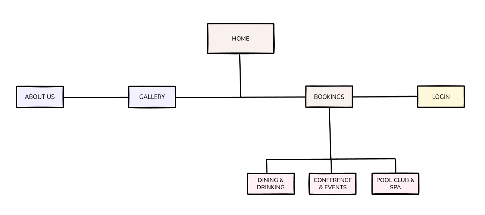

# Frontend Developer Guide

Developer guide for setting up and working with the frontend codebase. Contains setup instructions, project structure overview, and development workflow conventions.

See the main **[README](../README.md)** for complete tech stack and ADR documentation.

## Site Navigation



[Edit diagram in Excalidraw](https://excalidraw.com/#json=BdvcJwUIBZ9_A5NroHjtU,5JZtOOeIxq_-3Xo4xksisA)

Main navigation pages:

- **Home** - Landing page
- **About** - Company information
- **Gallery** - Image gallery
- **Bookings**
  - **Dining & Drinking** - Restaurant booking
  - **Pool Club & Spa** - Spa services booking
  - **Conference & Events** - Event space booking
- **Login** - User authentication

## Color Scheme

Application uses Mantine's color palette with the following semantic colors:

- **Success**: `teal.5`
- **Error**: `red.6`
- **Loading**: `dimmed` (adapts to dark/light mode)

## Frontend Structure

```
frontend/
├── src/
│   ├── app/
│   ├── components/
│   ├── lib/
│   │   ├── api/
│   │   └── utils/
│   └── types/
├── public/
├── images/
├── .husky/
├── .gitignore
├── .prettierrc
├── eslint.config.mjs
├── next.config.ts
├── package.json
├── tsconfig.json
└── README.md
```

## Quick Start

```bash
# Clone and navigate to frontend
git clone https://github.com/DennisByberg/clo24-denbyb94-exam.git
cd clo24-denbyb94-exam/frontend

# Install dependencies
bun install

# Start development server
bun run dev
```

Open [http://localhost:3000](http://localhost:3000) to see the app.

## Making Changes

1. **Create a new branch:**

   ```bash
   git checkout -b feature/your-feature-name
   ```

2. **Make your changes** in `frontend/` directory

3. **Test locally:**

   ```bash
   bun run dev    # Verify changes work
   bun run lint   # Check code quality
   ```

4. **Commit your changes:**

   ```bash
   git add .
   git commit -m "feat: your feature description #<issue number>"
   ```

   Pre-commit hooks will automatically run ESLint and Prettier.

5. **Push and create PR:**
   ```bash
   git push origin feature/your-feature-name
   ```
