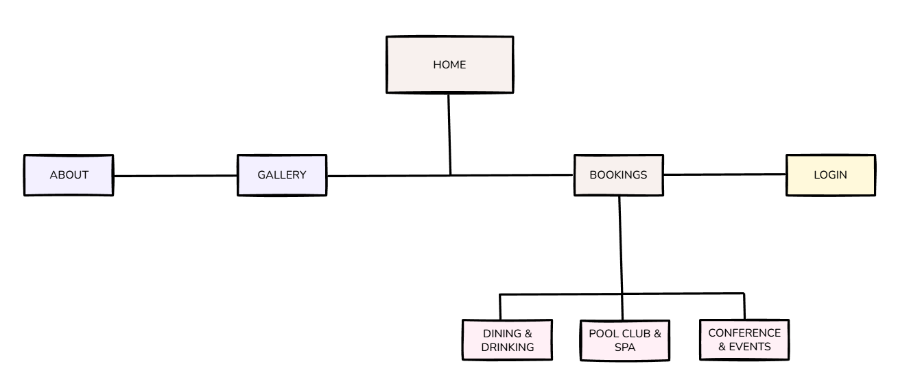

# Frontend Documentation

Developer guide for setting up and working with the frontend codebase. Contains setup instructions, project structure overview, and development workflow conventions.

See the main **[README](../README.md)** for complete tech stack and ADR documentation.

## 📁 Frontend Structure

```
frontend/
├── .husky/               # Git hooks
├── images/               # Static images and diagrams
├── public/               # Public static assets
├── src/
│   ├── app/              # Next.js App Router pages
│   ├── components/       # React components
│   ├── constants/        # Application constants
│   ├── lib/
│   │   ├── api/          # API client and endpoints
│   │   └── utils/        # Helper functions
│   └── types/            # TypeScript type definitions
├── .env.example          # Environment variables template
├── .gitignore            # Git ignore rules
├── .prettierrc           # Prettier configuration
├── bun.lock              # Bun lock file
├── eslint.config.mjs     # ESLint configuration
├── next.config.ts        # Next.js configuration
├── package.json          # Project dependencies
├── README.md             # (this file)
└── tsconfig.json         # TypeScript configuration
```

## 🗺️ Site Navigation



[Edit diagram in Excalidraw](https://excalidraw.com/#json=m3Dmc4u8ZSZGAGFjH_iu9,A8OGVGdCE6UbIjuc1FSyLg)

Main navigation pages:

- **Home** - Landing page
- **About** - Company information
- **Gallery** - Image gallery
- **Bookings**
  - **Dining & Drinking** - Restaurant booking
  - **Pool Club & Spa** - Spa services booking
  - **Conference & Events** - Event space booking
- **Login** - User authentication

## 🎨 Color Scheme

Application uses Mantine's color palette with the following semantic colors:

- **Success**: `teal.5`
- **Error**: `red.6`
- **Loading**: `dimmed` (adapts to dark/light mode)

## ⚙️ Environment Variables

See `.env.example` for required configuration.

## 🚀 Quick Start

**Prerequisites:** Docker Desktop must be running

1. **Clone and navigate to frontend:**

   ```bash
   git clone https://github.com/DennisByberg/clo24-denbyb94-exam.git
   cd clo24-denbyb94-exam/frontend
   ```

2. **Install dependencies:**

   ```bash
   bun install
   ```

3. **Start backend services:**

   ```bash
   cd ..
   docker-compose up -d
   ```

4. **Start development server:**

   ```bash
   cd frontend
   bun run dev
   ```

Open [http://localhost:3000](http://localhost:3000) to see the app.
